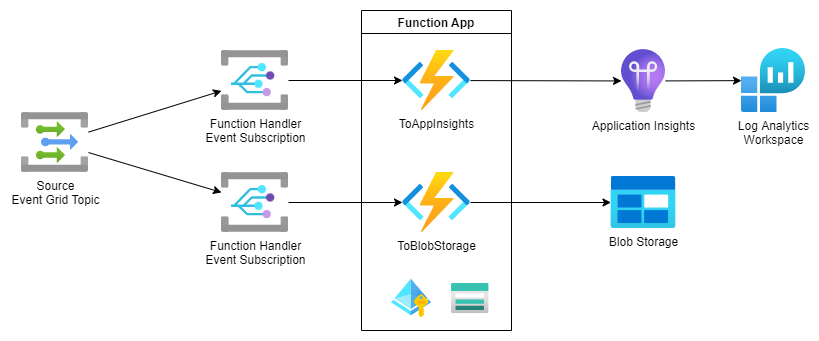

# Azure Function Handler for Event Grid to Application Insights & Blob Storage

## Overview

Azure Event Grid offers several built-in handlers, but none that push directly to Azure Monitor. This sample uses two Azure Functions that can be registered as Event Grid handlers for any Event Grid topic from which events should be logged. The sample handles the event in two ways -- creating a custom Application Insights event and/or persisting to Azure Blob Storage.



While not required, this sample was created using Visual Studio Code with the Azure Functions extension. The extension provides some useful shortcuts for debugging locally and deploying to Azure. If you would prefer use a different code editor, please refer to the files under the `.vscode` directory to see what commands are being used by the extension and VS Code to support local building, debugging, and deployment.

### Schema Support

This solution includes support for the default Event Grid Event schema and CloudEvents schema. The Event Grid trigger only supports the default schema; however, HTTP-triggered functions are used to handle Event Grid events in the CloudEvents schema. When setting up your event subscription, they will use the Webhook event delivery mechanism instead of tying directly to the function. They need to support sending a validation response to event subscription validation requests, and otherwise they are invoked once per element of the event array contained within the request body received when the Webhook Event is called. 

### Alternative Approach

While this solution includes Azure Functions as an intermediate to handle the destination of Azure Blob Storage in lieu of a built-in Event Grid handler, there may be cases where the [Capture feature of Event Hubs](https://docs.microsoft.com/en-us/azure/event-hubs/event-hubs-capture-overview) is a better fit for providing a long-term audit store of events. The Event Hubs Capture functionality is the best way to automatically capture streaming data to a long-term store. Additionally, there is a [built-in integration Event Grid handler for Event Hubs](https://docs.microsoft.com/en-us/azure/event-grid/handler-event-hubs) so that an intermediate Function would not be required.

## Run Locally

### 1. Update Azure Functions settings

At the base of the *src/AzureMonitorHandler.Functions* directory, create or update the `local.settings.json` file to include:

```jsonc
{
  "IsEncrypted": false,
  "Values": {
    /* An Azure Application Insights resource connection string is required. */
    "APPLICATIONINSIGHTS_CONNECTION_STRING": "<APPLICATION_INSIGHTS_CONNECTION_STRING>",
    /* Defines the storage target. For local development you can use the Azurite storage emulator,
     * or you can use an Azure resource (e.g., https://<ACCOUNTNAME>.blob.core.windows.net) as
     * long as the local credentials used to run the function have Storage Account Owner permissions
     * on the target account. This assumes you're running Azurite as described next. */
    "OUTPUT_STORAGE_ACCOUNT__blobServiceUri": "https://127.0.0.1:10000/devstoreaccount1",
    /* These aren't required for local development unless you want to trigger the CreateEventGridEvent
     * function and verify publish to the specified Azure Event Grid Topic. */
    "EVENT_GRID_TOPIC_URI": "",
    "EVENT_GRID_TOPIC_KEY": "",
    /* Required by the Function App host. For local development you can use the Azurite storage 
     * emulator, or you can use an Azure resource's connection string. This assumes you're running 
     * Azurite as described next.
     * Note: Connecting with an identity is in Preview, but it is not recommended over a connection
     * string without caution. */
    "AzureWebJobsStorage": "DefaultEndpointsProtocol=https;AccountName=devstoreaccount1;AccountKey=Eby8vdM02xNOcqFlqUwJPLlmEtlCDXJ1OUzFT50uSRZ6IFsuFq2UVErCz4I6tq/K1SZFPTOtr/KBHBeksoGMGw==;BlobEndpoint=https://127.0.0.1:10000/devstoreaccount1;QueueEndpoint=https://127.0.0.1:10001/devstoreaccount1;",
    /* Required for local debugging. */
    "languageWorkers:node:arguments": "--inspect=5858",
    /* Tells the Functions runtime this is a Node function. */
    "FUNCTIONS_WORKER_RUNTIME": "node"
  }
}
```

### 2. Run Azurite Storage Emulator

1. **Create a PEM certificate**
   ```sh
   cd path/to/pem-certs
   openssl req -newkey rsa:2048 -x509 -nodes -keyout key.pem -new -out cert.pem -sha256 -days 365 -addext "subjectAltName=IP:127.0.0.1" -subj "/C=CO/ST=ST/L=LO/O=OR/OU=OU/CN=CN"
   # Must run as Administrator
   certutil –addstore -enterprise –f "Root" cert.pem
   ```
1. **Run Azurite from Docker**
   ```sh
   docker run -p 10000:10000 -p 10001:10001 -p 10002:10002 -v path/to/cert:/certs \
     mcr.microsoft.com/azure-storage/azurite \
     azurite --blobHost 0.0.0.0 --queueHost 0.0.0.0 --tableHost 0.0.0.0 \
       --cert /certs/cert.pem --key /certs/key.pem --oauth basic
   ```

### 3. Run the Functions

If using VS Code, launch the `Attach to Node Functions` configuration using **F5** or from the *Run and Debug* view. This action should re-build and start the Functions runtime. If successful, your Terminal will show the output log of the local Azure Function Core Tools.

For HTTP triggered events (such as CreateEventGridEvent), you can use the HTTP endpoint exposed in the log or right-click on the function in the Azure Functions extension Functions browser and click *Execute Function Now...*.

### 4. Trigger Functions

The fastest way to test the functions locally is to create an HTTP request to trigger the functions. 

Event Grid triggered functions support triggering via request locally via a special local address `http://localhost:7071/runtime/webhooks/EventGrid`. An example of the request can be found in the `rest-samples/eventgridevent.rest` file (and directly sent if using the VS Code [REST Client extension](https://marketplace.visualstudio.com/items?itemName=humao.rest-client)).

The HTTP-triggered functions may be locally triggered via HTTP request as well. The body should be a JSON object conforming to the CloudEvent schema. Examples of the requests can be found in the `rest-samples/cloudevent.rest` file.

If you've dropped a breakpoint into the triggered function's index.js function export, VS Code's debugger should break to allow local variable investigation and stepping through the function handler code.

If you'd like to debug your local code against an actual Event Grid event, you can use the ngrok utility to expose the local function as an Event Grid webhook subscription. See <https://docs.microsoft.com/en-us/azure/azure-functions/functions-debug-event-grid-trigger-local#allow-azure-to-call-your-local-function> for detailed directions on how to setup.

## Deploy to Azure

1. **Provision the Resources**
   ```bash
   # Run from the /iac directory
   resourceGroup="rg-sample-eg-to-azmon"
   location="southcentralus"

   # Create the Resource Group
   az group create --name $resourceGroup --location "$location"

   # Kickoff the deployment
   az deployment group create --name DeployResources --resource-group $resourceGroup \
     --template-file .\fn-handler-with-appinsights-and-blob.bicep
   ```
1. **Deploy the Function Code** 
   * Using VS Code's Azure Function extension, highlight the Local Project and click the *Deploy to Function App...* button on the Functions section header. This action will build the code for production, create a Zip package, and deploy to the specified Function App.
   * Alternatively, you can use the Azure Functions Core Tools:
     ```sh
     # Run from the /src/AzureMonitorHandler.Functions directory
     func azure functionapp publish <function-app-name>
     ```
1. **Trigger an Event** The output from a successful deployment will include the Function URI to invoke the CreateEventGridEvent function. Open the URL and verify that the HTTP triggered function executed successfully.
